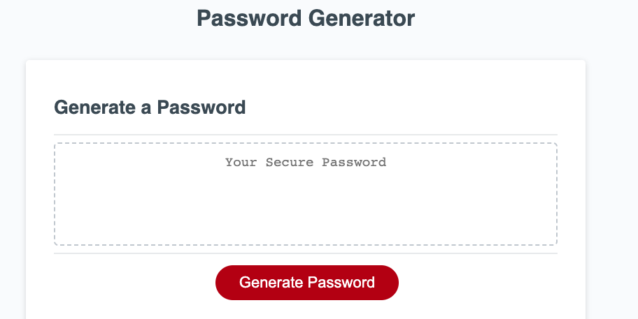

# <Password generator JavaScript fix>

## Description

I was tasked to fill out the JavaScript for this site, fulfilling the users wants of having a password generator using alerts and confirmation windows as the selectors for for the passwords character prompts. And having an end goal of having the password to generated and displayed on the site.

## Installation

N/A

## Usage

Upon visiting the site, you can click the generate password button and a series of alerts and prompts will guide you through your selections for your password, including. Character length, upper and lowercase characters, numbers, and special characters.

Note that, if an invalid character amount or invalid character, for the length of password, or entered, the user will be prompted to put in a valid character. Likewise, if the user selects no options for the password, they will be prompted to select at least one option. Check it out for yourself! [Password Generator Link Here](https://philippwinston.github.io/Password-Generator/).

## Credits

JS code #17,
learned about isNAN (Not a Number) from MDN web docs as i looked for a better way to catch incorrect characters for the Password lenth length.

[isNaN]
(https://developer.mozilla.org/en-US/docs/Web/JavaScript/Reference/Global_Objects/isNaN)

## License

N/A
